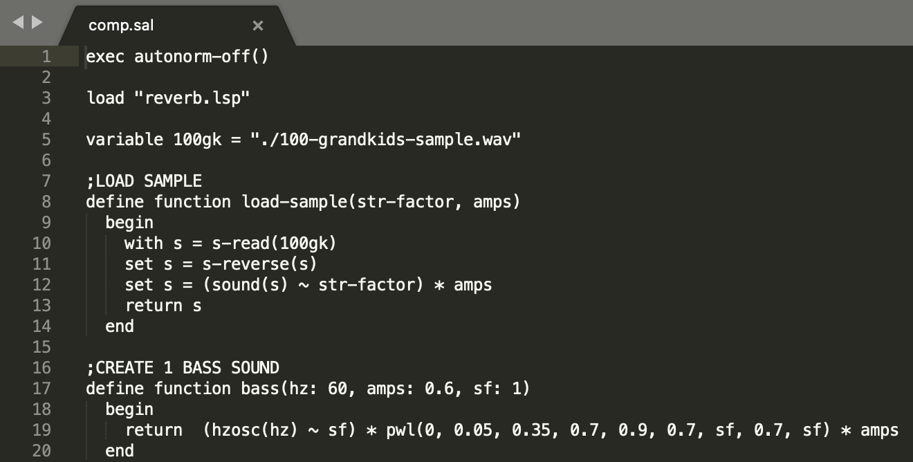

 

<h3>Composing Music with Nyquist SAL</h3>

 

 During my time at Carnegie Mellon University, I had the opportunity to study under Professor Roger Dannenberg, who is a professor emeritus of computer science, art, and music, as well as one of the creators of Nyquist. Nyquist is a language for sound synthesis and music composition that handles both signal processing and sound synthesis in a single integrated system. Unlike score languages that deal only with events or signal processing languages that focus only on signals and synthesis, Nyquist combines the two in a unique way.
  
 To create my composition using Nyquist, I started with a 19-second sample of "100 Grandkids" by Mac Miller, which can be played below.
  
<h4>100 Grandkids, Mac Miller</h4>
 
<audio src="audio/100-grandkids-sample.mp3" controls preload></audio>

  
 I employed several signal processing techniques, such as sound-stretching, amplitude modulation, and low-pass filters, to create the sounds in my final composition. The creation of my composition primarily relied on multiple functions, such as the <i>Load Sample</i> function. For those unfamiliar with Nyquist's coding syntax SAL, the Load Sample function reads a wave file, plays it backwards, stretches the sample by a given value, and sets its volume with amps. For those familiar with Python and other programming languages, these functions may be readable, although the syntax is distinct from more widespread languages.
  

<strong><i>Load Sample Function</i></strong>

  
 Although Nyquist requires coding instead of manipulating sound interactively, the techniques used to process and synthesize sounds are no different from those used in graphical interfaces such as GarageBand. However, the coding format offers greater control over the produced sound.
 
 
In the end, my composition, "Elevator Service," was created by running a simple function <mark>play sim(sound(comp()) * 0.7, sound(make-beat()) * 0.7)</mark>. Functions <mark>comp()</mark> and <mark>make-beat()</mark> call other functions. For more detail, you can view <a href="https://github.com/Sebastian-O-Rodriguez/about/tree/master/command-line-music/comp/comp.sal">the full composition</a>, which is written in SAL.   
<h4>&emsp;Final Composition</h4>
 
<audio src="audio/elevator-service.mp3" controls preload></audio>
   

