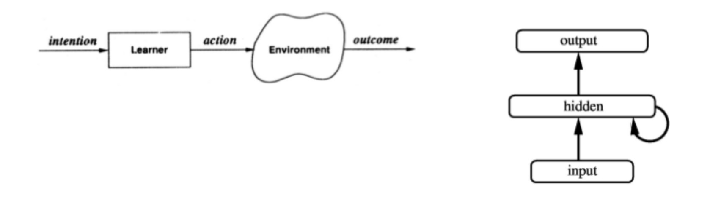
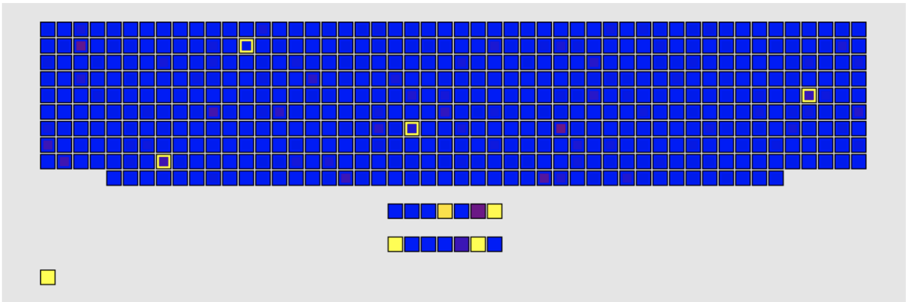
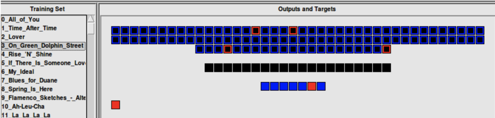

 

<h3>Playlist Generation using LENS</h3>

 

During my time as a student at Carnegie Mellon University, I had the opportunity to work with David Plaut, a Professor of Psychology with a joint appointment in the Carnegie Mellon Neuroscience Institute and the head of the Plaut Lab at CMU. At CMU, I used LENS, which stands for Light Efficient Network Simulator, a <a href="https://ni.cmu.edu/~plaut/Lens/">neural network simulator</a> created by a graduate student, and also used at the MIT Tedlab. My research involved using LENS to create a neural network that generates a playlist of songs based on the input of one song, influenced by a user's musical taste.
  
>My motivation for this research is inspired by the dominant music providers such as Spotify, Apple Music, and Pandora who offer personalized playlists of 'new' music to each user. However, companies like Spotify use a lot more data than I have access to, such as the preferences of millions of users. For this research, I created a dataset of close to 500 songs to represent my musical taste. Each song is broken down into seven numerical metrics, creating a fingerprint for each song, and tested on both Feed-Forward and Recurrent Neural Networks.
  

<strong><i>Depiction of Feed Forward Network &emsp;&emsp;&emsp;&emsp;&emsp;&emsp;&emsp; Depiction of Recurrent Network&emsp;</i></strong>

  
The neural network begins by training the Feed-Forward Network on 490 songs. In this simulation, the network takes in a song in the form of its seven song features, where each feature has been normalized to its respective z-score. The features are then fed into a hidden layer of seven units and into an output of 490 songs. The goal is that highly activated outputs of an input song would result in a playlist influenced by the chosen song as well as the user's preferences (in this paper, my preferences). However, even with numerous variations in weight decay and training periods, this network did not produce many insightful results. The most useful result is shown in the image below, where song number 488 "Countdown" showed unique activations, and the lone bright square in the bottom left is an activation of 1.0, representing the input song, "Countdown".
  

<strong><i>Song Number 488 "Countdown" after 320 epochs in a Feed Forward Network in LENS</i></strong>

  
Overall, the Feed-Forward Network did not generalize well from the dataset and was not useful in creating a playlist for any given song input. The goal of any network in LENS, for this project, is to generate a new playlist based on my preferences in the form of the dataset, and a song in the form of the input (where the input is seven feature values). All this stays true in the recurrent networks training, but with 20 hidden units and 100 output units. The output was reduced by 390 units for computational feasibility. Contradictory to my intuition, the Recurrent Network performed very poorly, and captured even less than the Feed-Forward Network. As it turns out, the cross-talk only worked to muddle any noticeable preference generations, even after 2000 epochs.
  

<strong><i>Song Number 3 "On Dolphin Street" after 2000 epochs in a Recurrent Network in LENS</i></strong>

  
Overall, the results of the feedforward network can be utilized for playlist generation. However, in order to obtain more accurate outcomes, it is necessary to increase the dataset size to thousands and introduce various other types of data. These could include metadata from multiple users, as well as natural language processing of songs and more comprehensive audio processing. For a more detailed understanding, please refer to the full research paper which is publicly available and accessible on my github repository.
   

<a href="https://github.com/Sebastian-O-Rodriguez/projects/blob/master/playlist_prediction_in_LENS.pdf"><button class="btn btn-default btn-lg"><i class="fa fa-github fa-lg"></i>
Full Paper</button></a>

